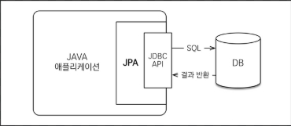
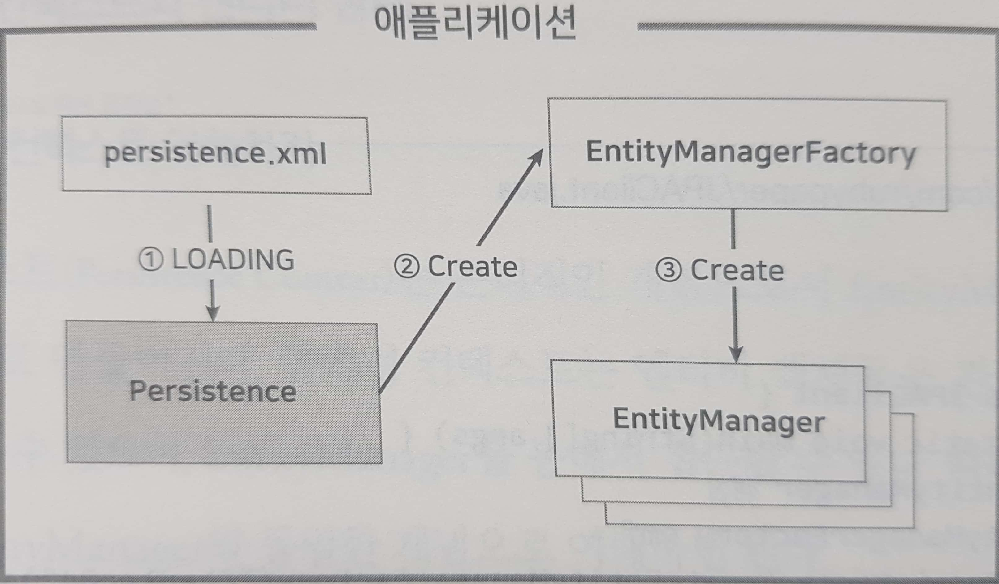
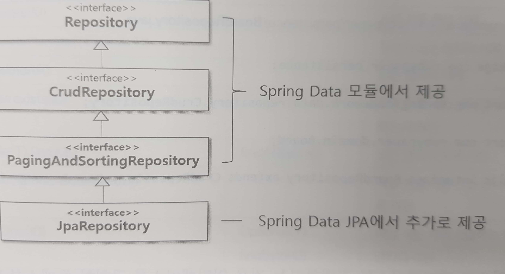

JPA 란?
=======
## 1. 스프링과 JPA
* JDBC : 데이터베이스 연동에 사용되는 전통적인 기술
* ORM : 스프링 DAO, 마이바티스, 하이버네이트 등등
* 하이버네이트 : 애플리케이션에서 사용하는 SQL까지도 프레임워크에서 제공하기 때문에 개발자가 처리해야 할 일들을 엄청나게 줄여준다.
* JPA : 이런 ORM들을 보다 쉽게 사용할 수 있도록 표준화 시킨 것, 복잡한 JPA의 개념이나 동작 원리를 모르고도 쉽게 사용할 수 있다.

##### 1.1 SQL을 직접 다루지 않는 기술
개발자가 SQL을 직접 다루지 않는 대표적인 기술이 하이버네이트 같은 ORM이다. 
일반적으로 데이터베이스의 값을 객체에 담아서 사용하는 경우보다 관리가 쉽다. 
BoardVO 같은 객체를 Map같은 컬렉션에 저장하고 관리하는 것이다.

## 2. JPA 란?
#### 2.1 JPA 개념
* 하이버네이트 : 자바 표준은 아니지만 가장 많은 개발자들이 사용하는 ORM. 
기존의 EJB(Enterprise Java Beans)기술인 엔티티 빈이 가지는 여러 문제들을 대체하기 위한 오픈소스 프레임워크로 등장 
* JPA : 하이버네이트 개발자들이 중심이 되어 만든 ORM 표준 JDBC API와 같은 개념으로 이해하면 쉽다.
* JDBC : JDBC API는 java.sql 패키지로서, JDBC 인터페이스를 이용하여 DB 연동을 처리하고, 실제 실행될 때는 인터페이스를 구현한 드라이버 객체가 동작한다. DB를 변경할 때, DB에 종속적인 드라이버만 교체하면 애플리케이션 소스는 수정하지 않아도 되기 때문이다.

JPA도 제공하는 인터페이스를 이용해서 DB를 연동하면, 실제로는 JPA를 구현한 구현체가 동작하는 것이다.
* JPA 구현체 종류 : JPA를 구현한 구현체 로는 Hibernate , EclipseLink ,DataNucleus 등이 있다. 
스프링 부트에서는 기본적으로 **하이버네이트**를 JPA 구현체로 사용한다.

#### 2.2 JPA 동작 원리
JPA는 자바 애플리케이션과 JDBC 사이에 존재하면서 JDBC의 복잡한 절차를 대신 처리해준다. 따라서 개발자는 JDBC의 복잡한 API를 모르고도 데이터베이스를 사용할 수 있다. 
; 
**중요한것은 JPA가 데이터베이스 연동에 사용되는 코드뿐만 아니라 SQL까지 제공한다**
 그래서 JPA를 이용해 데이터베이스 연동을 처리하면 개발 및 유지보수의 편의성이 높아진다.   

## 3. JPA 설정
대부분의 프레임워크가 설정을 할 때 xml로 관리한다. JPA도 persistence.xml파일로 관리한다.

#### 3.1 영속성 유닛 설정
* < persistence> : persistence.xml 파일의 루트
* < persistence-unit> : 영속성 유닛에 해당하는 엘리먼트 / 연동하려는 DB가 여러개면 < persistence-unit>을 여러개 설정할 수 있다. 여러개 등록시 식별하기 위해서 유일한 이름을 name속성으로 지정 한다.
* persistence Unit 설정 
<pre>
 < persistence-unit name="Chapter04">
</pre>
* Java 소스 
<pre>
    //EntityManager 생성
    EntityManagerFactory emf = 
        Persistence.createEntityManagerFactory("Chapter04");
    EntityManager em = emf.createEntityManager();
</pre>
설정 후 진행 순서  
* 클래스 목록이 등록된다. 
* DB 연결 데이터소스 설정 추가 
* Dialect 클래스 설정 
JPA의 가장 큰 장점 중 하나는 데이터베이스 연동에 필요한 SQL 구문을 자동을 생성한다는 것 
하지만 SQL을 잘 작성했다고 해도, 데이터베이스마다 키 생성 방식, 함수 등이 다르기 때문에 데이터베이스가 달라지면 모든 부분을 찾아서 수정해야한다. 이런 점을 해결해 주는것이 H2Dialect 클래스 등록이다.
* JPA구현체 설정 
JPA는 다양한 ORM 프레임워크를 동일한 방법으로 사용하기 위한 인터페이스에 불과하다. 따라서 실질적으로 기능을 제공할 JPA구현체에 대한 설정이 필요. 

|속성|의미|
|:--|:--|
|hibernate.show_sql|하이버네이트가 생성한 SQL을 콘솔에 출력|
|hibernate.format_sql|하이버네이트가 생성한 SQL을 출력할 때, 보기 좋은 포맷으로 출력|
|hibernate.use_sql_comments|SQL에 포함된 주석(Comment)도 같이 출력|
|hibernate.id.new_generator_mappings|키 생성 전략을 사용|
|hibernate.hbm2ddl.auto|테이블 생성(create)이나 변경(alter),삭제(drop) 같은 DDL구문을 자동으로 실행할지 지정한다.|

hibernate.id.new_generator_mappings : 테이블에 Primary Key값을 자동으로 증가시키려면 속성을 true로 설정하면 된다. 
hibernate.hbm2ddl.auto : 엔티티를 기준으로 테이블을 새롭게 생성할지, 또는 기존의 테이블을 재사용할지 등의 여부를 결정할 수 있다. 

* hibernate.hbm2ddl.auto 속성 값의 의미

|속성값|의미|
|:---|:---|
|create|애플리케이션을 실행할 때, 기존 테이블을 삭제하고 엔티티에 설정된 매핑 정보를 참조하여 새로운 테이블을 생성한다.(DROP -> CREATE)|
|create-drop|create와 같지만 애플리케이션이 종료되기 직전에 생성된 테이블을 삭제한다.(DROP -> CREATE -> DROP)|
|update|기존에 사용 중인 테이블이 있으면 테이블을 생성하지 않고 재사용한다. 없을 때만 새롭게 생성한다. 만약 엔티티 클래스의 매핑 설정이 변경되면 변경된 내용만 반영한다.(ALTER)|

#### 3.2 엔티티 매핑
JPA는 엔티티 클래스에 매핑과 관련된 어노테이션만 적절히 설정하면 엔티티를 이용해서 데이터를 쉽게 관리할 수 있다. 

1. Entity와 Id 어노테이션 
@Entity : 자바 클래스를 JPA가 관리하는 엔티티로 인식하게하는 어노테이션 
@Id : 엔티티로부터 생성된 객체를 다른 객체와 식별 할 수 있게 하는 어노테이션 
식별자 필드 : 테이블에 저장된 각 row는 PK칼럼을 통해 유일한 데이터로 식별할 수 있다. 이런 테이블과 매핑되는 엔티티가 가지고 있는 PK 칼럼과 매핑될 식별자

2. Table 어노테이션 
엔티티 이름과 테이블 이름이 다른 경우 @Table을 이용해서 매핑할 테이블 이름을 정확히 지정해야 한다.
* Table 속성

|속성|설명|
|:---|:---|
|name|매핑될 테이블 이름을 지정한다.|
|catalog|데이터베이스 카탈로그(catalog)를 지정한다.|
|schema|데이터베이스 스키마(schema)를 지정한다.|
|uniqueConstraints|결합 unique 제약조건을 지정. 여러 개의 칼럼이 결합되어 유일성을 보장해야 하는 경우 사용.|

3. Column 어노테이션 
엔티티의 변수와 테이블의 칼럼을 매핑할 때 사용. 일반적으로 엔티티 변수 이름과 칼럼 이름이 다를 때 사용. 생략하면 변수 이름과 동일한 이름의 칼럼이 매핑된다.
* Column 속성

|속성|설명|
|:---|:---|
|name|칼럼 이름을 지정한다.|
|unique|unique 제약조건을 추가한다.(기본값:false)|
|nullable|null 상태 허용 여부를 설정한다.(기본값:false)|
|insertable|INSERT를 생성할 때 칼럼을 포함할 것인지 결정한다.(기본값:true)|
|updatable|UPDATE를 생성할 때 이 칼럼을 포함할 것인지 결정한다.(기본값:true)|
|columnDefinition|이 컬럼에 대한 DDL문을 직접 기술한다.|
|length|문자열 타입의 칼럼 길이를 지정한다(기본값:255)|
|precision|숫자 타입의 전체 자릿수를 지정한다.(기본값:0)|
|scale|숫자 타입의 소수점 자릿수를 지정한다.(기본값:0)|

4. Temporal 어노테이션 
java.util.Date 타입의 날짜 데이터를 매핑할 때 사용. TemporalType을 이용하여 날짜의 형식을 지정할 수 있다. 
TemporalType.DATE : 날짜 
TemporalType.TIME : 시간 
TemporalType.TIMESTAMP : 날짜와 시간 모두 출력 

5. Transient 어노테이션 
엔티티 클래스 내의 특정 변수를 영속 필드에서 제외할 때 사용. 
엔티티 클래스의 변수들은 대부부 테이블의 칼럼과 매핑. 하지만 몇몇 변수는 매핑되는 칼럼이 없거나 검색 관련 변수같이 임시로 사용되는 변수들은 아예 매핑에서 제외해야 하는 경우도 있다.

#### 3.3 식별자 값 자동 증가
1. 식별자 값 자동 증가란? 
테이블과 매핑되는 엔티티는 반드시 PK 칼럼과 매핑될 식별자 필드를 가져야 한다. 그래서 @Id 어노테이션을 이용해서 매핑한다. **JPA가 엔티티를 이용해 등록 작업을 처리할 때, 식별자 필드에 값이 설정되지 않으면 예외가 발생** 따라서 식별자 필드에는 유니크한 값이 반드시 설정되어야 한다. 
@GeneratedValue : 식별자 필드에 자동으로 증가된 값을 할당할 때 사용. 

|속성|설명|
|:--|:--|
|strategy|자동 생성 전략을 선택한다.(GenerationType 지정)|
|generator|이미 생성된 키 생성기를 참조|

* strategy의 PK 값 생성 전략을 지정하는 속성

|PK전략|해설|
|:---|:---|
|GenerationType.TABLE|하이버네이트가 테이블을 사용하여 PK값을 생성한다. 따라서 PK값 생성만을 위한 별도의 테이블이 필요하다.|
|GenerationType.SEQUENCE|시퀀스를 이용하여 PK값을 생성한다. 당연히 이 전략은 시퀀스를 지원하는 데이터베이스에서만 사용할 수 있다.|
|GenerationType.IDENTITY|auto_incremenet나 IDENTITY를 이용하여 PK값을 생성한다. 일반적으로 MySql 같은 데이터베이스를 이용할 때 사용한다.|
|GenerationType.AUTO|하이버네이트가 데이터베이스에 맞는 PK값 생성 전략을 선택한다(기본값으로 사용)|

2. 테이블 전략 vs 시퀀스 전략  
식별자 값 자동 증가하기 위해서 두 가지 방식이 있고, 각각 장,단점은 이렇다. 

* 테이블 전략

장점 : 데이터베이스에 무관하게 범용적으로 사용가능. 
단점 : 테이블을 별도로 생성해야하고 키 값을 자동으로 증가시키기 위해 별도의 UPDATE 작업을 수행해야 하는 성능상의 문제가 있다. 

* 시퀀스 전략

장점 : 별도의 테이블이 필요 없으며, 등록 작업의 처리 속도가 빠르다. 
단점 : 오라클,H2 같은 시퀀스를 지원하는 DB 에서만 사용 가능하다 

## 4. JPA API 이해
#### 4.1 EntityManagerFactory와 EntityManager
* EntityManager : JPA를 이용하는 애플리케이션의 시작은 EntityManager의 생성이다.JPA를 이용해서 CRUD기능을 처리할라면 필요하다. EntityManagerFactory로 부터 얻을 수 있다. 
 

1. Persistence 클래스를 이용하여 영속성 유닛(persistence-unit)정보가 저장된 JPA메인 환결설정 파일(persistence.xml)을 로딩한다.
2. 영속성 유닛(persistence-unit) 설정 정보를 바탕으로 EntityManagerFactory 객체를 생성한다.
3. EntityManagerFactory로부터 EntityManager를 얻어서 데이터베이스 연동을 처리한다. 
* 그림은 실제 JPA가 자동으로 META-INF 폴더에 있는 persistence.xml 파일을 로딩하는 과정으로 이해하면 된다.
* EntityManager 가 제공하는 CURD 기능의 메소드 

|메소드|기능설명|
|:---|:---|
|persist(Object entity)|엔티티를 영속화한다.(INSERT)|
|merge(Object entity)|준영속 상태의 엔티티를 영속화한다.(UPDATE)|
|remove(Object entity)|영속 상태의 엔티티를 제거한다.(DELETE)|
|find(Class< T> entityClass, Object primaryKey)|하나의 엔티티를 검색한다.(SELECT ONE)|
|createQuery(String jpql, Class< T> resultClass)|JPQL에 해당하는 엔티티 목록을 검색한다.(SELECT LIST)|

#### 4.2 영속성 컨텍스트 이해하기
Persistence Context : 논리적인 개념으로, EntityManager를 생성할 때 자동으로 만들어진다. 엔티티 객체들을 관리하는 일종의 컨테이너이다. 
그림과 같이 비영속(New),영속(Managed),준영속(Detached),삭제(Removed)상태로 존재 

 

|상태|의미|
|:--|:--|
|비영속|엔티티가 영속성 컨텍스트와 전혀 무관한 상태|
|영속|엔티티가 영속성 컨텍스트에 저장된 상태|
|준영속|엔티티가 한번 영속성 컨텍스트에 저장되었다가 분리된 상태|
|삭제|엔티티가 영속성 컨텍스트에서 삭제된 상태|

1. 비영속 상태(NEW) 
비영속 상태는 엔티티 객체를 생성만 했을 뿐 아직 엔티티를 영속성 컨텍스트에 저장하지 않은 상태. 

2. 영속 상태(MANAGED) 
EntityManager를 통해 엔티티가 영속성 컨텍스트에 저장된 상태를 의미. 영속 상태로 만들기 위해서는 EntityManager의 persist()메소드 사용. 
EntityManager의 find() 메소드를 통해서도 엔티티를 영속 상태로 가능 
find() 메소드를 호출했을 때, 조회하고자 하는 엔티티가 영속성 컨텍스트에 있으면 해당 엔티티가 반환, 만약 없으면 DB에서 데이터를 조회하여 새로운 엔티티 객체를 생성하여 영속성 컨텍스트에 저장

3. 준영속 상태(DETATCHED) 
한번 영송석 컨텍스트에 들어간 엔티티가 어떤 이유에서 영속성 컨텍스트에서 벗어난 상태.준영속 상태의 엔티티는 값을 수정해도 데이터베이스에 아무런 영향을 미치지 못한다.

|메소드|의미|
|:--|:--|
|detach(entity)|특정 엔티티만 준영속 상태로 전환한다.|
|clear()|영속성 컨텍스트를 초기화한다. 영속성 컨텍스트가 관리하던 엔티티들을 모두 삭제한다.|
|close()|영속성 컨텍스트를 종료한다. 영속성 컨텍스는 종료되기 직전에 자신이 관리하던 엔티티들을 모두 삭제한다.|

4. 삭제 상태(REMOVED) 
영속성 컨텍스트에서도 제거되고, 테이블의 데이터도 삭제된 상태. 
영속 상태의 엔티티는 remove() 메소드를 이용해서 삭제할 수 있다. 삭제된 엔티티는 재사용하지 않고 가비지 컬렉션이 된다. 

##### 4.3 영속성 컨텍스트와 1차 캐시
EntityManager의 persist()메소드를 통해 특정 엔티티를 영속성 컨텍스트에 등록하면, 저장된 엔티티에 해당하는 INSERT가 실행된다. 그런데 JPA가 곧바로 테이블에 INSERT를 실행하지 않는다. 그 이유는 영속성 컨텍스트 내부에 1차 캐시를 사용해서이다. 
1차 캐시 : 일종의 Map같은 컬렉션이다. Key,Value로 엔티티를 관리한다. 
실제 데이터베이스에 반영 시점 : 1차 캐시에 저장된 엔티티는 EntityTransaction으로 트랜잭션을 종료할 때 반영된다. 

#### 4.4 영속성 컨텍스트와 SQL 저장소
엔티티를 영속성 컨텍스트에 저장되는 순서 
1. 엔티티를 1차 캐시에 등록 
2. 1차 캐시에 등록된 엔티티에 해당하는 INSERT 구문을 생성 후 SQL 저장소에 등록 
2-1. 만약 새로운 엔티티가 등록되면 순서대로 1차 캐시와 SQL 저장소에 각각 엔티티와 SQL구문들이 누적되어 저장되고, commit()메소드 실행 후 트랜잭션을 종료하면 SQL 저장소에 저장된 모든 SQL이 한꺼번에 데이터베이스로 전송 

#### 4.5 엔티티 수정
* 엔티티 수정 과정 
1. find()메소드로 엔티티 검색 
만약 수정할 엔티티가 영속성 컨텍스트에 없다면 예외 발생 
2. 검색된 엔티티는 영속성 컨텍스트 내의 1차 캐시에 저장 
3. 엔티티의 변수 값 수정
4. JPA는 수정된 변수들을 검색 UPDATE구문 작성 후 SQL 저장소에 저장 
5. 트랜잭션이 종료 되면 실질적인 UPDATE가 처리 

**수정 기능을 테스트하려면 BOARD 테이블이 삭제 되면 안된다. 그러므로 persistence.xml 파일의 hibernate.hbm2ddl.auto속성 값을 update로 수정**

스냅샷(SnapShot) : 엔티티를 영속성 컨텍스트에 저장할 때, 엔티티의 복사본을 별도의 컬렉션에 저장한다. 이 공간이 스냅샷 
* 스냅샷 진행 과정 
1. 트랜잭션 종료
2. 스냅샷에 저장된 원래의 엔티티와 1차 캐시에 수정된 엔티티 비교
3. 변경된 값을 이용해서 UPDATE 생성
4. UPDATE 구문을 SQL에 저장
5. 트랜잭션이 종료될 때 다른 SQL들과 같이 데이터베이스에 하번에 전송

* JPA 수정 특징
1. 기본 전략은 모든 필드 수정
2. 모든 필드를 수정하기 때문에 수정 쿼리가 항상 같아서 애플리케이션 로딩 시점에 수정 쿼리를 미리 생성해 두고 재사용 가능
3. 동일한 쿼리를 데이터베이스에 보내면 이전에 한 번 파싱했던 쿼리를 재사용 할 수 있어서, 성능상의 이점이 있다.

#### 4.6 엔티티 삭제
* 삭제 과정
1. remove()메소드로 엔티티 삭제
2. 영속성 컨텍스트에서 해당 엔티티 제거
3. DELETE 구문이 SQL 저장소에 등록
4. 트랜잭션이 종료되면 SQL 저장소에 저장된 DELETE가 데이터베이스에 전송

* 주의할 점
수정과 마찬가지로 영속성 컨텍스트에 삭제할 엔티티가 없다면 예외가 발생 
그래서 삭제하기 전에 반드시 엔티티를 검색해서 영속성 컨텍스트에 등록해야한다.

#### 4.7 목록 검색과 JPQL
JPQL : 특정 데이터를 상세 조회하려면 find() 메소드 사용. 목록을 조회하기 위해서는 JPQL 사용.

* 주의할 점
JPQL로 검색 기능을 수행하면 쿼리를 실행하기 전에 SQL 저장소에 저장되어 있던 모든 SQL 구문들을 데이터베이스에 전송한다. 그래야 영속성 컨텍스트에 없는 데이터를 데이터베이스로부터 조회하여 등록할 수 있다.

## 5. 스프링 데이터 JPA
#### 5.1 스프링 데이터 JPA 퀵스타트
* JPA starter : 스프링 부트에서 JPA 연동에 필요한 라이브러리들과 복잡한 XML 설정을 자동으로 처리하기 위해 사용

#### 5.2 Repository 인터페이스
Repository : 기존의 DAO(Data Access Object)와 동일한 개념으로 비즈니스 클래스에서는 이 Repository를 이용해서 실질적인 데이터베이스 연동을 처리한다. 
* Repository 인터페이스 상속 구조

 

Repository : 기능이 거의 없는 없다  
CrudRepository : 주로 사용하고, CRUD 기능을 제공
PagingAndSortingRepository : 검색 기능이 필요하고, 검색 결과 화면에 대해 페이징 처리 필요 할 때 사용. 
JpaRepository : 스프링데이터 JPA에서 추가한 기능을 사용하고 싶을 때 사용 
위의 Repository 인터페이스들의 공통점 : 두 개의 제네릭 타입을 지정
<pre>
CrudRepository< T,ID>
T : 엔티티의 클래스 타입
ID : 식별자 타입(@Id로 매핑한 식별자 변수의 타입)
</pre>

* CrudRepository 를 상속하는 방법
<pre>
package com.rubypaper.persistence;

import org.springframework.data.repository.CrudRepository;

import com.rubypaper.domain.Board;

public interface BoardRepository extends CrudRepository<Board, Long> {

}
</pre>
* 일반적인 스프링 프로젝트와 다른점 :  
일반적으로 인터페이스는 객체로 생성할 수 없고 다른 클래스들의 부모로만 사용된다. 하지만 스프링 데이터 JPA 를 사용하면 별도의 구현 클래스를 만들지 않고 인터페이스만 정의해도 기능 구현 가능. **스프링부트가 내부적으로 인터페이스에 대한 구현 객체를 자동으로 생성**
한다는 것을 의미한다. 
또한 JPA를 이용해서 데이터베이스를 연동하기 위해 EntityManagerFactory, EntityManager, EntityTransaction 같은 객체도 내부적으로 처리 되기 때문에 필요 없다. 

* CrudRepository 인터페이스 메소드 기능(spring boot 2.xx version) 

|메소드|기능|
|:--|:--|
|long count()|모든 엔티티의 개수 리턴|
|void delete(ID)|식별 키를 통한 삭제|
|void delete(Iterable<? Extends T>)|주어진 모든 엔티티 삭제|
|void deleteAll()|모든 엔티티 삭제|
|boolean exists(ID)|식별 키를 가진 엔티티가 존재 하는지 확인|
|Iterable< T>findAll()|모든 엔티티 목록 리턴|
|Iterable< T>findAll(Iterable< ID>)|해당 식별 키를 가진 엔티티 목록 리턴|
|T findOne< ID>|해당 식별 키에 해당하는 단일 엔티티 리턴|
|< S extends T>Iterable< S>save(Iterable< S>)|여러 엔티티들을 한 번에 등록, 수정|
|< S extends T>S save< S entity>|하나의 엔티티를 등록,수정|

#### 5.3 쿼리 메소드 사용하기
일반적으로 JPA를 이용해서 목록 기능을 구현할 때는 JPQL을 이용한다. 
JPQL은 검색 대상이 테이블이 아닌 엔티티라는 것만 제외하고는 기본 구조와 문법이 기존의 SQL과 유사하다. 하지만 엔티티를 대상으로 검색을 처리해야 하기 때문에 다소 복잡할 수 있다.
이런 복잡한 JPQL을 메소드로 대신 처리 할 수 있는것이 쿼리 메소드 이다. 
쿼리 메소드 : 메소드의 이름으로 필요한 쿼리를 만들어 주는 기능. 
* 쿼리 메소드 사용 TIP
1. 작성 때 엔티티 이름 생략 가능 
엔티티 이름을 생략하면 현재 사용하는 Repository 인터페이스에 선언된 타입 정보를 기준으로 자동 엔티티 이름이 적용.
2. 쿼리 메소드 리턴 타입 
Page< T>, Slice< T>, List< T> 중에 가장 많이 사용하는 것은 Page< T>, List< T>이다. List< T> = 단순한 목록 검색 / Page< T> = 페이징 처리 
3. 쿼리 메소드 유형 

|키워드|예시|생성되는 SQL|
|:--|:---|:---|
|And|findByLastnameAndFirstname|where x.lastname = ? 1 and x.firstname = ? 2|
|Or|findByLsatnameOrFirstname|where x.lastname = ? 1 or x.firstname = ? 2|
|Between|findByStartDateBetween|where x.startDate between ? 1 and ? 2|
|IsNull|findByAgeIsNull|where x.age is null|
|IsNotNull, NotNull|findByAge(Is)NotNull|where x.age is not null|
|Like|findByFirstnameLike|where x.firstname like ? 1|
|Containing|findByFirstnameContaining|where x.firstname like '%'||?1||'%'|
|OrderBy|findByAgeOrderByLastnameDesc|where x.age = ? 1 order by x.lastname desc|
|Not|findByLastnameNot|where x.lastname <> ? 1|
|In|findByAgeIn(Collection< Age> ages)|where x.age in ? 1|

4. Page< T> 타입 
검색 결과를 List< T> 타입으로 받아도 되지만, 스프링 MVC에서 검색을 이용할 경우 Page< T>를 사용하는 것이 좋다. 다양한 정보들을 추가로 제공하기 때문이다. 

|메소드|설명|
|:---|:---|
|int getNumber()|현재 페이지 정보|
|int getSize()|한 페이지의 크기|
|int getTotalPages()|전체 페이지의 수|
|int getNumberOfElements()|결과 데이터 수|
|boolean hasPreviousPage()|이전 페이지의 존재 여부|
|boolean hasNextPage()|다음 페이지의 존재 여부|
|boolean isLastPage()|마지막 페이지의 존재 여부|
|Pageable nextPageable()|다음 페이지 객체|
|Pageable previeousPageable()|이전 페이지 객체|
|List< T> getContent()|조회된 데이터 목록|
|boolean hasContent()|결과 존재 여부|
|Sort getSort()|검색 시 사용된 Sort 정보|

#### 5.4 @Query 어노테이션
@Query : 복작한 쿼리를 사용하거나 join을 하기 위해서 JPQL을 가능하게 하는 어노테이션 

#### 5.5 QueryDSL 이용하기
웹 애플리케이션에서 검색 기능을 구현할 때 검색 조건은 다양하게 구성되는데, 그래서 다양한 검색 쿼리를 미리 등록해서 사용하면 비슷한 쿼리가 너무 많이 작성되므로 관리하기가 어렵다. 그래서 일반적으로 동적 쿼리를 작성하기 위해서 마이바티스를 사용한다. 
마이바티스는 조건에 따라서 쿼리의 특정 구문을 변형시킬 수 있기 때문에 유연한 쿼리를 사용할 수 있다. 

* QueryDSL 마이바티스처럼 동적으로 쿼리를 처리 할 수 있게 해준다. 
오픈소스 프로젝트로 쿼리를 문자열이 아닌 자바 코드로 작성할 수 있도록 지원하는 일종의 JPQL 빌더이다.

* 사용가능한 메소드

|메소드|설명|
|:--|:---|
|long count(Predicate p)|검색된 데이터의 전체 개수|
|boolean exists(Predicate p)|검색된 데이터의 존재 여부|
|Iterable< T> findAll(Predicate p)|조건에 맞는 모든 데이터 목록|
|Page< T> findAll(Predicate p)|조건에 맞는 데이터 목록|
|Iterable< t>findAll(Predicate p, Sort s)|조건에 맞는 모든 데이터 목록 정렬|
|T findOne(Predicate p)|조건에 맞는 하나의 데이터|

