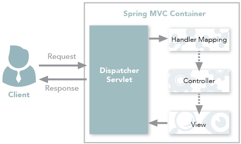

게시판을 작성하면서 알게된 사실들 기록하기 RECORD
=============================================
## 1. 어노테이션
#### 1.1 RestController 와 Controller 차이점
둘의 주요한 차이점은 HTTP ResponseBody가 생성되는 방식이다. 
* Controller - view  
전통적인 Spring MVC 의 컨트롤러. 주로 view를 반환하기 위해서 사용한다.
 
Controller가 요청을 처리한 후에 응답을 DispatcherServlet으로 반환 
DispatcherServlet은 View를 사용자에게 반환
* Controller - Data  
Data를 반환해야 하는 경우. @ResponseBody를 활용해서 Json 형태로 데이터를 반환.
 
* RestController 
Spring MVC Controller에 @ResponseBody가 추가된것. Json/Xml 형태로 객체 데이터를 반환하는 것이 주용도. java 객체로 전달할 경우 자동으로 Json으로 변환 해서 처리. Restful 웹서비스의 생산을 단순화 하기 위해 만들어짐. 
 

#### 1.2 AuthenticationPrincipal 이란?
spring security가 제공하는 argumentResolver 
로그인한 사용자에 대한 정보를 참조하고 싶을 때, securityUser가 아닌 커스텀 한 principal을 사용할 수 있다.
<pre>
@PostMapping("/insertBoard")
	public String insertBoard(Board board, @AuthenticationPrincipal SecurityUser principal) {
		board.setMember(principal.getMember());
		boardService.insertBoard(board);
		return "redirect:getBoardList";
	}
</pre>
==============================================
## 2. 클래스
#### 2.1 enum
enum = **서로 연결된 상수들의 집합**
* enum의 장점
1. 코드가 단순해지고, 가독성 ▲
2. 인스턴스 생성과 상속을 방지하여 상수값의 타입 안정성을 보장
3. enum class를 사용해 상수들의 타입을 정의함으로 정의한 타입외의 타입을 가진 데이터값을 컴파일시 체크 가능.
4. 키워드 enum을 사용하기 때문에 구현의 의도가 열거임을 명확하게 알 수 있다.

* enum 사용
<pre>
public enum Role {
	ROLE_MEMBER, ROLE_ADMIN
}
</pre>
Role class는 인스터스를 따로 생성하지 않았지만 내부적으로는 다음과 같다
<pre>
public enum Role{
    public static final Role ROLE_MEMBER = new Role();
    public static final Role ROLE_ADMIN = new Role();
}
</pre>

* enum 특징
1. 열거형으로 선언된 순서에 따라 0부터 인덱스 값을 가진다. 순차적으로 증가
2. 모든 대문자로 선언해야한다.
3. 마지막에 선언된 열거형변수 끝에 세미콜론(;)을 찍지 않는다. 
(상수와 연관된 문자를 연결시킬 경우 세미콜론(;)을 찍는다)

* enum 메소드

<table border="1">
<th>구분</th>
<th>메소드명</th>
<th>설명</th>
<tr>
<td rowspan="3" align="center">Staic Methods</td>
<td>valueOf(String arg)</td>
<td>String 값을 enum에서 가져옴. 값이 없으면 예외 발생</td>
<tr>
<td>valueOf(class< T>class, String arg)</td>
<td>넘겨받은 class에서 String찾아, enum에 가져옴 valuOf(String arg)는 내부적으로 자기자신 Class를 가져옴</td>
</tr>
</tr>

</table>
|구분|메소드명|설명|
|:--|:--|:--|
|static Methods|valueOf(String arg)|String 값을 enum에서 가져옴.값이 없으면 예외 발생

