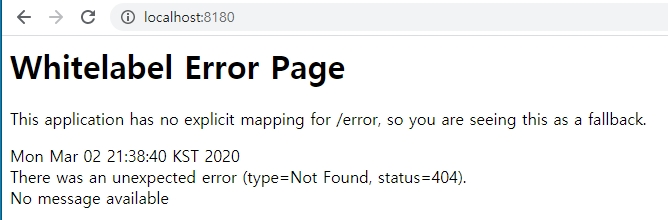
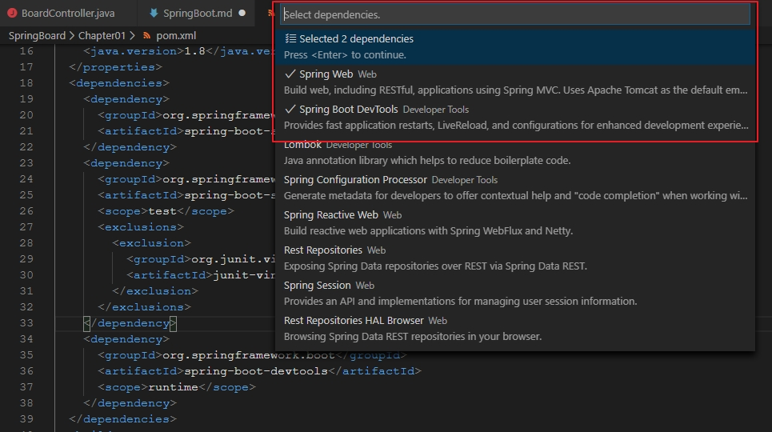

Spring Boot
============
## 1. spring boot?
스프링부트는 단독실행하면, 상용화 수준의 스프링 기반 애플리케이션을 쉽게 만들어 낼 수 있다. 
최소한의 설정으로 스프링 플랫폼과 서드파티 라이브러리들을 사용할 수 있다. 
#### 스프링 부트 주요 목표
* 모든 spring 개발에 대해 빠르고 광범위하게 접근 가능한 시작 환경 제공
* 기본값에서 벗어난 요구사항들을 신속하게 해결
* 대규모 프로젝트에 공통되는 다양한 비기능 기능 제공한다(임베디드 서버, 보안, 메트릭, 상태 점검 및 외부화된 구성)
* 설정을 위한 xml 코드를 요구하지 않는다.

## 2. spring project
스프링 프로젝트 생성시 Maven과 Gradle 중에 선택을 해야한다. 
#### Maven?
* java용 프로젝트 관리 도구
* java 빌드 도구의 사살상의 표준
* xml 기반의 빌드 처리 (간단한 내용은 괜찮은데, 복잡한 내용을 작성하게 되면 xml 기반의 묘사는 상당히 어려워진다.)
* 프로젝트 규모가 작을 경우에는 Gradle과 차이가 적지만, 규모가 커질 경우 Gradle이 유리 / 확장성 ▼ 빌드 속도 ▼
* 다른 프로젝트에 특정 설정을 사용하기 위해서 상속을 해야한다.
#### Gradle?
* Groovy를 이용한 빌드 자동화 시스템
* 여러가지 언어 지원 (java, C, C++, Python)
* Groovy는 jvm에서 실행되는 스크립트 언어이다. java와 다른점은 소스 코드를 컴파일 할 필요가 없다. 
Groovy는 스크립트 언어로 소스 코드 그대로 실행된다. Java와 호환도 가능한 점 때문에 급성장 하고 있다.
* 대규모 프로젝트에서는 Maven보다 유리하다 / 확장성 ▲ 빌드 속도 ▲
* 다른 프로젝트에서 특정 설정을 사용하기 위해서 '설정 주입 방식'으로 해결

프로젝트 배포 형식은 jar 과 war 중에 선택을 해야한다. 
둘다 jar 툴을 사용한 압축 파일이지만, 사용 목적이 다르다.
#### jar
* 라이브러리, 플러그인, 애플리케이션 형태로 사용할 수 있게 여러 파일들을 묶을 수 있다.
* 원하는 구조로 생성 가능하다.
* 부가적인 소프트웨어 없이도 커맨드 라인에서 jar 파일을 실행할 수 있다.
#### war
* 웹에서 사용
* WEB-INF 와 META-INF 구조로만 생성이 가능하다.
* 서버로만 실행이 가능하다.

#### 시스템 요구 사항
* Java 8 / Java 11과 호환 가능
* maven - 3.3 이상 / gradle - 4.4 이상
* 내장 서블릿 컨테이너 지원

|이름|서블릿버전|
|:--:|:--|
|tomcar 9.0|4.0|
|jetty 9.4|3.1|
|undertow 2.0|4.0|

## 3. 스프링 부트 설치
Java SDK v1.8 이상 필요. 
* cmd창에 '$ java -version'으로 버전 확인 가능

#### 3.1 maven 설치
Spring Boot는 Apache Maven 3.3이상과 호환된다. 
일반적으로 Maven POM 파일은 'spring-boot-starter-parent'프로젝트에서 상속되며 하나 이상의 "Starters"에 대한 종속성을 선언한다.
<pre>
//Spring Boot 에서 기본값 상속
< parent>
    < groupId>org.springframework.boot< /groupId>
    < artifactId>spring-boot-starter-parent< /artifactId>
    < version>2.1.6.RELEASE< /version>
< /parent>

//웹 애플리케이션에 대한 일반적인 종속성 추가
< dependencies>
    < dependency>
        < groupId>org.springframework.boot< /groupId>
        < artifactId>spring-boot-starter-web< /artifactId>
    < /dependency>
< /dependencies>

//실행 가능한 jar 패키지 
	< build> 
		< plugins> 
			< plugin> 
				< groupId> org.springframework.boot < /groupId> 
				< artifactId>spring-boot-maven-plugin < /artifactId> 
			< /plugin> 
		< /plugins>
	< /build>
</pre>

#### 3.2 gradle 설치
gradle을 사용해서 spring boot에 종속성을 선언 할 수 있다. 일반적으로 프로젝트는 하나 이상의 starter에 종속성을 선언한다. spring boot는 의존성 선언을 단순화하고 실행 가능한 jar을 만드는데 사용할 수 있는 유용한 gradle 플러그인을 제공.
* gradle wrapper는 프로젝트를 빌드해야 할 때 gradle을 얻는 좋은 방법을 제공한다. 빌드 프로세스를 부트 스트랩하기 위해 코드와 함께 커밋하는 작은 스크립트 및 라이브러리이다.

#### 3.3 spring boot CLI 설치
spring Boot CLI(Command Line Interface)은 spring으로 신속하게 프로토 타입을 작성하는데 사용한다. 
Groovy 스크립트를 실행할 수 있다. 이 점은 많은 상용구 코드없이 친숙한 java 유사 구문을 가지고 있음을 의미.

#### 3.4 project 설치 후 각 폴더의 의미
* src/main/java : 일반적인 자바 소스
* src/test/java : jUnit 기반의 테스트 케이스
* src/main/resources : xml, properties  
기존의 메이븐 기반 프로젝트와 다른점. 
src/main/resources 를 보면 xml 파일이 아닌 static, templates 폴더가 있다 
* static 폴더 : HTML 같은 정적인 웹리소스 저장
* templates 폴더 : 타임리프 같은 템플릿 기반의 웹리소스 저장
* application.properties 파일 : 프로젝트 전체에서 사용할 프로퍼티 정보들

#### 3.5 project main class run
src/main/java 소스 폴더에 '프로젝트 이름 + Application.java' 파일이 있다. 
실행시키고 브라우저에 기본포트인 http://localhost:8080/ 을 입력하면 아마도 다음과 같이 뜰 것이다. 

내장 톰캣이 인식해야 하는 index.html , index.jsp가 없기 때문이다. 
* 프로젝트 생성 시 'web' 스타터를 추가 할 때 웹 프로젝트 환경에 최적화된 라이브러리들을 등록해 준다. 이때 톰캣 라이브러리도 같이 다운된다. 

#### 3.6 WebApplicationType
* NONE : 웹으로 동작하지 않는다.
* SERVLET : 기존의 스프링 MVC를 기반으로 웹 애플리케이션을 구동
* REACTIVE : 스프링 5.0에 추가된 비동기 처리와 논블로킹 입출력을 지원하는 웹플럭스 적용

## 4. 스프링 부트 기능
#### 4.1 devTools
보통 컨트롤러에 새로운 메소드를 추가하거나 수정 사항이 있으면, 실행 중인 애플리케이션을 중지하고 재 실행해야 한다. 
**수정된 컨트롤러를 반영**하기 위해서다. **devTools를 이용하면 좀 더 편리하게 할 수 있다.** 

#### 4.2 devTools 설치 방법 (vscode)
1. 사용중인 프로젝트의 pom.xml 열기
2. dependency 태그 밑에서 마우스 오른쪽 버튼 클릭 후 Edit Starters 항목 클릭
3. 그림과 같이 devTools 선택 > 엔터 > 저장 (만약 충돌이 나서 선택하라고 하는 경고 메세지가 뜬다면 덮어쓰기 하면 된다.) 
 

#### 4.3 SpringBoot Test
#### 4.3.1 Mock 객체로 테스트하기
목(Mock) : 테스트를 위해 만든 모형 
모킹 (Mocking) : 테스트를 위해 실제 객체와 비슷한 모의 객체를 만드는 것 
목업 (Mock-up) : 모킹한 객체를 메모리에서 얻어내는 과정 
웹 애플리케이션은 복잡한 절차가 필요해서 자주 테스트 하기가 어렵다. 이렇기 때문에 객체와 비슷한 가짜 객체를 만들어서 
테스트에 필요한 기능만 가지도록 모킹해서 쉽게 테스트 하는것이 목적이다. 
실제 컨트롤러를 테스트하려면 서블릿 컨테이너 구동, DispatcherServlet 객체가 메모리에 올라가야 한다. 
하지만 서블릿 컨테이너를 모킹하면 테스트용 모형 컨테이너를 사용하기 때문에 간단하게 컨트롤러를 테스트 할 수 있다. 

#### 4.3.2 @WebMvcTest
@Controller, @RestController가 설정된 클래스들을 찾아 메모리에 생성한다. 
하지만, @service와 @Repository가 붙은 객체들은 테스트 대상이 아닌것으로 처리된다.
<pre>
@WebMvcTest
public class BoardControllerTest{

}
</pre>

#### 4.3.3 @AutoConfigureMockMvc
 @WebMvcTest 와 비슷하게 사용할 수 있는 어노테이션 
 @SpringBootTest 에는 테스트를 지원하는 webEnvironment 속성이 있다. 기본값은 MOCK로 설정된다. 
 이 설정에 의해서 서블릿 컨테이너가 모킹된다. (테스트 케이스 실행 시 서블릿 컨테이너를 구동하지 않는다.) 
 모킹한 객체를 의존성 주입 받으려면 @AutoConfigureMockMvc를 클래스 위에 추가해야 한다.
 <pre>
@SpringBootTest(webEnvironment = WebEnvironment.MOCK)
@AutoConfigureMockMvc
public class BoardControllerTest {
 </pre>
* WebMvcTest 와 차이점 
@AutoConfigureMockMvc는 컨트롤러뿐 아니라 테스트 대상이 아닌 @Service나 @Repository가 붙은 객체들도 모두 메모리에 올린다. 
간단한 테스트를 하기 위해서는 @WebMvcTest를 사용해야 한다. 

#### 4.3.4 MockMvc
* perform() 
MockMvc가 제공하는 perform()을 사용하면 서버에서 url을 요청하듯 컨트롤러를 실행시킬 수 있다. 
MockMvcRequestBuilders의 정적메소드를 이용해서 생성된 RequestBuilder 객체를 인자로 받는다 
perform()로 요청을 전송하면, ResultActions객체를 리턴 받는다. 
ResultActions는 응답 결과를 검증할 수 있는 andExpect()메소드를 제공한다. 
컨트롤러의 동작을 테스트하기 위해서는 요청도 중요하지만, 컨트롤러가 어떤 결과를 전송했는지 검증하는 것이 가장 중요하다. 서버의 응답 결과는 MockMvcResultMatchers 객체의 메소드를 이용해서 검증 할 수 있다. 

#### 4.3.5 MockMvcResultMatchers
status()메소드로 응답 상태 코드를 검증 할 수 있다. 
|메소드|설명|
|:--|:--|
|isOk()|응답 상태 코드가 정상적인 처리에 해당하는 200인지 확인|
|isNotFound()|응답 상태 코드가 404 Not Found인지 확인|
|isMethodNotAllowed()|응답 상태 코드가 메소드 불일치에 해당하는 405인지 확인|
|isInternalServerError()|응답 상태 코드가 예외 발생에 해당하는 500인지 확인|
|is(int status)|몇번 응담 상태코드가 설정되어 있는지 확인 예) is(200),is(400)|

* 컨트롤러가 리턴하는 뷰를 검증 할 때는 view() 사용 
<pre>
andExpect(view().name("hello"))
</pre>
컨트롤러가 리턴한 뷰 이름이 hello인지 검증한다. 
만약 요청 처리 결과가 리다이렉트 응답이라면
<pre>
andExpect(redirectedUrl("/index"))
</pre>

* model() 
컨트롤러에서 저장한 모델의 정보들을 검증하고 싶으면 사용한다. 

|메소드|설명|
|:--|:--|
|attributeExists(String name)|name에 해당하는 데이터가 Model에 포함되어 있는지 검증|
|atrribute(String name,Object value)|name에 해당하는 데이터가 value객체인지 검증|

* andDO(ResultHandler handler) 
테스트 진행할 때 실제로 생성된 요청과 응답 메세지를 모두 확인하고 싶을 때 사용

